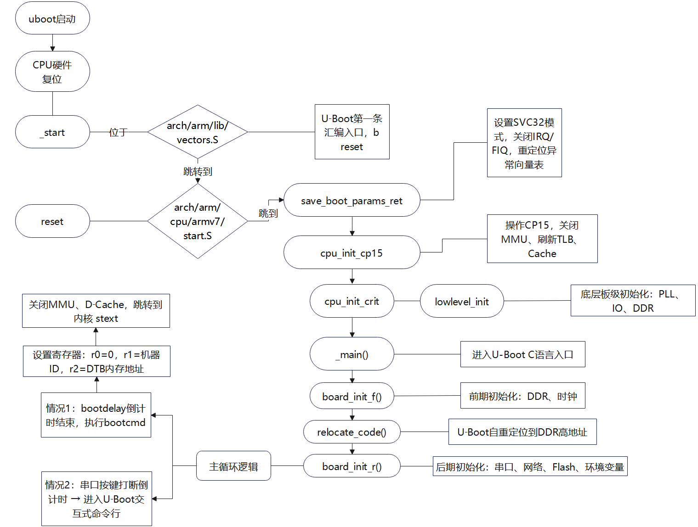
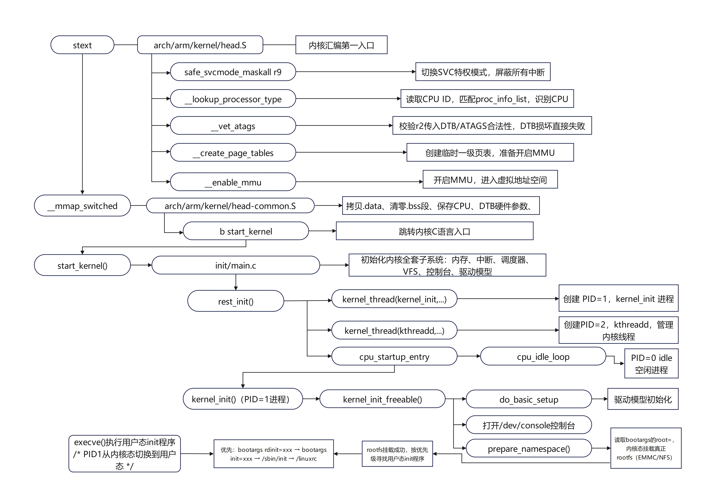
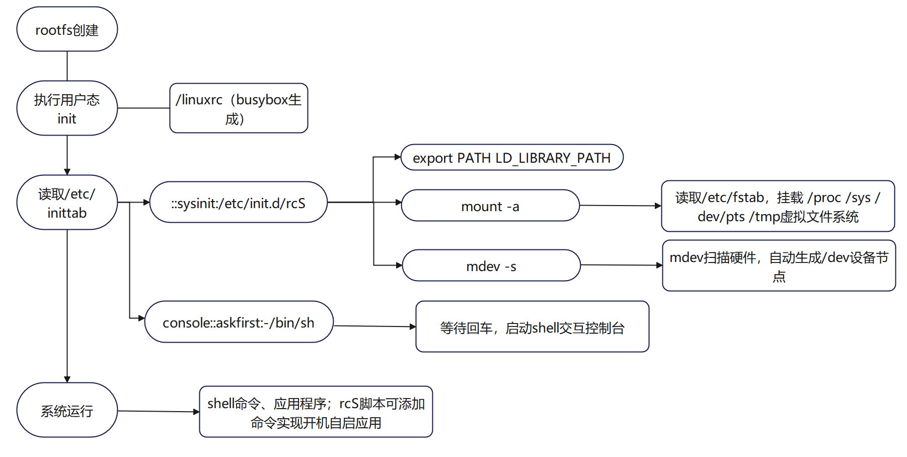

# 系统移植梳理
## 1.关键节点
### 1.1 U-Boot 启动的第一行代码
入口点在 `arch/arm/lib/vectors.S` 中的 `_start`，第一行代码是 `b reset` 跳转到 reset 函数：
`b reset` → `save_boot_params` → `save_boot_params_ret`。

### 1.2 U-Boot 命令行在哪

`cli_loop` 函数位于 `common/cli.c` 中，倒计时被打断就进入 U-Boot。

### 1.3 U-Boot 的 main_loop 函数在哪里

`main_loop` 在 `common/main.c`。

### 1.4 Kernel 启动的第一行代码

位于 `arch/arm/kernel/head.S` 的 `ENTRY(stext)`，在里面配置内核表。

### 1.5 Kernel 的 init 函数

位于 `init/main.c`，由 `rest_init()` 调用 `kernel_thread()` 创建，作用概括：

- 挂载根文件系统
- 找到并运行用户态 init
- 完成从内核态到用户态的切换

### 1.6 在哪里挂载 rootfs

#### 1.6.1 内核态挂载真正的根文件系统（EMMC）

PID=1 的 `kernel_init` 执行过程，读取 U-Boot 传的 `bootargs` 变量，解析 `root=` 参数，内核完成挂载根文件系统。

#### 1.6.2 用户态挂载虚拟文件系统（proc/sysfs/tmpfs）

真正 rootfs 挂载成功后，执行 rootfs 里面脚本 `/etc/init.d/rcS`；脚本执行 `mount -a`，读取 `/etc/fstab` 挂载的如 `/proc`、`/sys`、`/dev/pts`、`/tmp` 等虚拟文件系统。

---

## 2. 三大件启动流程

### 2.1 U-Boot 启动流程



### 2.2 Kernel 启动



### 2.3 Rootfs 启动流程



---

## 3. U-Boot / Kernel / FDT / Rootfs 在 EMMC/SD 卡存放的位置

开发板 EMMC 版本：`mmc dev 1`；SD 卡版本：`mmc dev 0`。

### 3.1 EMMC 布局逻辑

| 资源 | EMMC 存放位置 | 分区类型 | 说明 |
|------|---------------|----------|------|
| **u-boot.imx** | EMMC 头部，分区表之前的原始扇区 | 裸数据 raw，无文件系统 | 不属于任何 FAT、EXT4 分区；直接往物理扇区写入二进制镜像；写入错误会直接导致板子变砖 |
| **zImage（kernel 内核）** | mmc1:1 分区 1 | FAT 文件系统分区 | 带文件系统，可以使用 `fatload` 读取、`fatwrite` 写入；zImage 和 dtb 放在同一个 FAT 分区 |
| **dtb (fdt 设备树)** | mmc1:1 分区 1 | FAT 文件系统分区 | 和内核 zImage 一起存放在 FAT 分区 |
| **rootfs 根文件系统** | mmc1:2 分区 2 | EXT4 文件系统分区 | Linux 根文件系统，解压后的一堆目录文件，属于 ext4 文件系统 |

### 3.2 SD 卡（mmc dev 0）布局逻辑

同上，但设备号为 `mmc0:x`。

---

## 4. 升级四大件的方案

### 4.1 方案一：MfgTool 烧写

**前提**：烧写环境 —— MfgTool 官方工具 + USB-OTG 连接开发板

**步骤**：

1. 准备编译产物：`u-boot.imx`、`zImage`、`imx6ull-alientek-emmc.dtb`

2. 打包 rootfs：

   ```bash 
   cd rootfs 
   tar -vcjf rootfs.tar.bz2 *
   ```

3. 板子拨码拨到 **USB 下载模式**，按下复位，电脑识别设备

4. 四个固件替换 MfgTool 工具下 `firmware`、`files` 目录下对应文件

5. 双击对应的 `.vbs` 脚本点击 **Start** 开始烧写

***MfgTool 内部自动执行整套动作**：

1. DDR 里面临时启动一套 Linux
2. 对 EMMC 做分区、格式化
3. 把 `u-boot.imx` 写入 EMMC 头部 raw 裸扇区
4. 把 `zImage`、`dtb` 写入 FAT 分区 `mmc1:1`
5. 解压 `rootfs.tar.bz2` 到 EXT4 分区 `mmc1:2`

6. 烧写完成，拨码切回 **EMMC 启动**，重启开发板

---

### 4.2 方案二：U-Boot 命令行 + TFTP 单独升级某个组件

**前提**：Ubuntu 开启 TFTP 服务，固件放到 `tftpboot` 目录；开发板网口连通，进入 U-Boot 命令行。

> **注意**：升级 U-Boot 很容易变砖。

#### 1）升级 u-boot.imx（raw 裸扇区写入，无文件系统）

```bash
tftp 80800000 u-boot.imx
mmc dev 1
mmc write 80800000 0x2 0x400
```

> `mmc write`：直接写物理扇区，不是文件系统操作。

#### 2）升级 kernel zImage（FAT 分区 mmc1:1）

```bash
tftp 80800000 zImage
mmc dev 1
fatwrite mmc 1:1 80800000 zImage ${filesize}
```
#### 3）升级 dtb（FAT 分区 mmc1:1）
```bash
tftp 80800000 imx6ull-alientek-emmc.dtb
mmc dev 1
fatwrite mmc 1:1 80800000 imx6ull-alientek-emmc.dtb ${filesize}
```
#### 4）升级 rootfs（EXT4 分区 mmc1:2）

开发板设置 `bootargs`，**NFS 网络挂载 rootfs 启动**，此时 EMMC 上 `mmc1:2` 分区处于空闲状态，挂载该分区，把整套新 rootfs 复制进去；或者 U-Boot 把 `rootfs.tar.bz2` 下载到 DDR，解压写入 EMMC 的 ext4 分区。                              


